<div align="center">

# Olá, eu sou o Igor 

### Desenvolvimento de sistemas, automação e análise de dados

[](https://www.linkedin.com/in/igor-cechinato-de-lima-6099a726/)
[](https://www.instagram.com/_igor_c_lima_/)
[](https://igorcdelima.github.io/portifolio/)
[](mailto:igor.c.l.oficial@outlook.com)

</div>

<div align="center">

</div>

<br>

## Sobre mim

Sou estudante de Ciência da Computação na **Universidade de Caxias do Sul (UCS)**, atualmente no **7º semestre**, e trabalho na **Escola SuperGeeks**, em Caxias do Sul — RS, onde atuo com desenvolvimento e também como **professor de Programação**.

No dia a dia, desenvolvo sistemas, trabalho com **APIs em Python (FastAPI)**, uso **Docker** para organizar e publicar aplicações, e tenho experiência em **atendimento a clientes** — entender o problema de quem vou ajudar antes de sair escrevendo código.

Venho também direcionando meus estudos para **análise e tratamento de dados**, com o objetivo de seguir, mais adiante, para engenharia de dados e IA.

```text
entender o problema  →  construir a solução  →  entregar
```


## O que estou fazendo atualmente

- 🎓 Cursando o 7º semestre de Ciência da Computação (UCS)
- 👨‍🏫 Ensinando Programação na Escola SuperGeeks
- 🛠️ Desenvolvendo sistemas e APIs com Python e FastAPI
- 📊 Estudando análise e tratamento de dados

## Áreas de interesse

`Desenvolvimento de sistemas` · `Automação` · `APIs` · `Bancos de dados` · `Análise de dados` · `Engenharia de dados` · `Docker`

## Tecnologias

Ferramentas que uso no trabalho e nos estudos:


> Python, FastAPI e Docker são o que uso com mais frequência hoje. As demais linguagens fazem parte da minha formação.

## Projetos

Estrutura em construção — em breve trago aqui os projetos que venho desenvolvendo, com descrição, tecnologias utilizadas e links.

## Experiência

| | |
|---|---|
| **Professor de Programação** | Escola SuperGeeks — Caxias do Sul |
| **Desenvolvimento** | Sistemas, APIs (FastAPI) e Docker |
| **Atendimento a clientes** | Entender a necessidade antes de propor a solução |
| **Formação** | Ciência da Computação — UCS (7º semestre) |

## Contato

📍 Caxias do Sul — RS, Brasil
📫 [igor.c.l.oficial@outlook.com](mailto:igor.c.l.oficial@outlook.com)
💼 [LinkedIn](https://www.linkedin.com/in/igor-cechinato-de-lima-6099a726/)
🌐 [Portfólio](https://igorcdelima.github.io/portifolio/)

<div align="center">
<sub>Construído aos poucos, um problema resolvido de cada vez.</sub>
</div>
